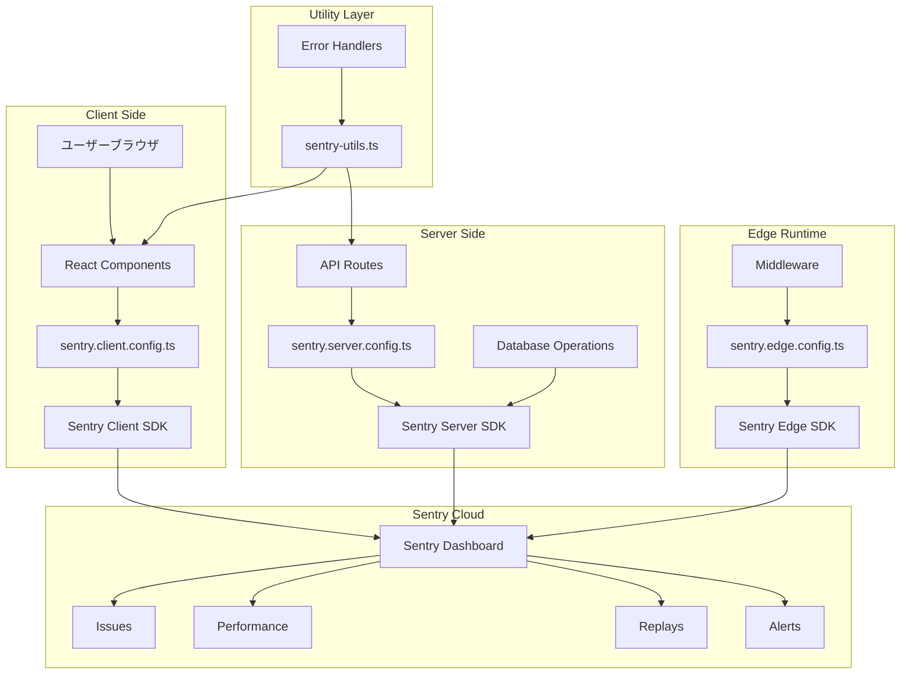

# Sentry統合実装レポート - 会計自動化システム

## TL;DR

会計自動化システムにSentry（エラートラッキング・パフォーマンス監視サービス）を統合しました。これにより、本番環境でのエラーの自動収集、パフォーマンスの監視、ユーザー体験の追跡が可能になりました。エラーハンドリング、ロギング、トレーシングの各機能を実装し、開発効率と品質保証プロセスが大幅に向上しました。

## 目次

1. [構造の説明](#構造の説明)
2. [構造の図解](#構造の図解)
3. [機能一覧](#機能一覧)
4. [ディレクトリの図解](#ディレクトリの図解)
5. [ディレクトリごとに設定したコード](#ディレクトリごとに設定したコード)
6. [注意点](#注意点)
7. [今後の課題](#今後の課題)
8. [トラブルシューティング](#トラブルシューティング)

## 構造の説明

### Sentryアーキテクチャ概要

Sentryは以下の3つの環境で動作するように設定されています：

1. **クライアントサイド（ブラウザ）**
   - ユーザーのブラウザで発生するエラーをキャプチャ
   - ユーザーインタラクションのトラッキング
   - セッションリプレイ機能

2. **サーバーサイド（Node.js）**
   - APIエンドポイントでのエラーキャプチャ
   - データベース操作のトラッキング
   - サーバーサイドレンダリングのエラー

3. **エッジ環境（Edge Runtime）**
   - ミドルウェアでのエラーキャプチャ
   - エッジ関数のパフォーマンス監視

### 統合コンポーネント

- **エラートラッキング**: 自動的なエラー収集と分析
- **パフォーマンストラッキング**: トランザクションとスパンによる詳細な監視
- **ロギング統合**: console.log/error/warnの自動収集
- **セッションリプレイ**: ユーザー操作の記録と再生

## 構造の図解



## 機能一覧

### 1. エラートラッキング機能

| 機能 | 説明 | 実装場所 |
|------|------|----------|
| 自動エラーキャプチャ | 未処理のエラーを自動的に収集 | 全環境 |
| 手動エラーキャプチャ | `Sentry.captureException()` | カスタムエラーハンドリング |
| コンテキスト付きエラー | ユーザー情報、タグ、追加データ付き | `captureErrorWithContext()` |
| エラーレベル設定 | fatal, error, warning, info, debug | ロギング機能 |

### 2. パフォーマンストラッキング機能

| 機能 | 説明 | 実装場所 |
|------|------|----------|
| UIアクショントラッキング | ボタンクリック等の監視 | `trackUIAction()` |
| APIコールトラッキング | HTTP通信の監視 | `trackAPICall()` |
| DBオペレーショントラッキング | データベース操作の監視 | `trackDBOperation()` |
| ビジネスロジックトラッキング | カスタム処理の監視 | `trackBusinessOperation()` |

### 3. ロギング機能

| レベル | 用途 | 例 |
|--------|------|-----|
| trace | 詳細なデバッグ情報 | `logger.trace("Starting process", { step: 1 })` |
| debug | 開発時の情報 | `logger.debug(logger.fmt\`User ${userId} accessed\`)` |
| info | 重要なビジネスイベント | `logger.info("Invoice created", { id: "INV-001" })` |
| warn | 注意が必要な状況 | `logger.warn("API limit approaching", { current: 450 })` |
| error | エラーだが処理は継続 | `logger.error("Email send failed", { recipient })` |
| fatal | 致命的なエラー | `logger.fatal("Database connection lost")` |

### 4. セッションリプレイ機能

| 機能 | 説明 | 設定 |
|------|------|------|
| エラー時の自動記録 | エラー発生時のユーザー操作を記録 | 100% |
| 通常セッションの記録 | 正常時の操作も一部記録 | 10% |
| プライバシー保護 | テキスト・画像のマスキング | 有効 |

## ディレクトリの図解

```
accounting-automation/
├── sentry.client.config.ts      # クライアントサイド設定
├── sentry.server.config.ts      # サーバーサイド設定
├── sentry.edge.config.ts        # エッジランタイム設定
├── .sentryclirc                 # Sentry CLI設定
├── lib/
│   ├── sentry-utils.ts         # Sentryユーティリティ関数
│   └── api-error-handler.ts    # 既存のエラーハンドラー
├── app/
│   ├── global-error.tsx        # グローバルエラーハンドラー
│   └── sentry-example-page/    # テストページ
│       └── page.tsx
├── components/
│   └── sentry-examples.tsx     # 実装例コンポーネント
└── docs/
    ├── SENTRY_SETUP_GUIDE.md   # セットアップガイド
    └── SENTRY_IMPLEMENTATION_GUIDE.md # 実装ガイド
```

## ディレクトリごとに設定したコード

### 1. ルートディレクトリ設定ファイル

#### sentry.client.config.ts
```typescript
import * as Sentry from "@sentry/nextjs";

Sentry.init({
  dsn: process.env.NEXT_PUBLIC_SENTRY_DSN,
  tracesSampleRate: 1.0,
  debug: false,
  replaysOnErrorSampleRate: 1.0,
  replaysSessionSampleRate: 0.1,
  integrations: [
    Sentry.replayIntegration({
      maskAllText: true,
      blockAllMedia: true,
    }),
    Sentry.consoleLoggingIntegration({ 
      levels: ["log", "error", "warn"] 
    }),
  ],
  environment: process.env.NODE_ENV,
  _experiments: {
    enableLogs: true,
  },
});
```

#### sentry.server.config.ts
```typescript
import * as Sentry from "@sentry/nextjs";

Sentry.init({
  dsn: process.env.SENTRY_DSN || process.env.NEXT_PUBLIC_SENTRY_DSN,
  tracesSampleRate: 1.0,
  debug: false,
  environment: process.env.NODE_ENV,
  _experiments: {
    enableLogs: true,
  },
  integrations: [
    Sentry.consoleLoggingIntegration({ 
      levels: ["log", "error", "warn"] 
    }),
  ],
});
```

### 2. lib/sentry-utils.ts

主要なトラッキング関数：

```typescript
// UIアクショントラッキング
export function trackUIAction<T>(
  operationName: string,
  attributes: Record<string, any>,
  callback: () => T
): T

// APIコールトラッキング
export async function trackAPICall<T>(
  method: string,
  endpoint: string,
  callback: () => Promise<T>
): Promise<T>

// DBオペレーショントラッキング
export async function trackDBOperation<T>(
  operation: string,
  collection: string,
  callback: () => Promise<T>
): Promise<T>

// ビジネスロジックトラッキング
export async function trackBusinessOperation<T>(
  operationName: string,
  context: Record<string, any>,
  callback: () => Promise<T>
): Promise<T>

// コンテキスト付きエラーキャプチャ
export function captureErrorWithContext(
  error: Error | unknown,
  context: {
    operation?: string;
    userId?: string;
    entityId?: string;
    entityType?: string;
    [key: string]: any;
  }
): void
```

### 3. app/global-error.tsx

```typescript
'use client';

import * as Sentry from "@sentry/nextjs";
import Error from "next/error";
import { useEffect } from "react";

export default function GlobalError({
  error,
}: {
  error: Error & { digest?: string };
}) {
  useEffect(() => {
    Sentry.captureException(error);
  }, [error]);

  return (
    <html>
      <body>
        <Error statusCode={undefined} />
      </body>
    </html>
  );
}
```

### 4. next.config.js の更新

```javascript
const { withSentryConfig } = require("@sentry/nextjs");

// Sentry設定オプション
const sentryWebpackPluginOptions = {
  silent: true,
  org: "effect-cz",
  project: "mastra-accounting",
};

module.exports = withSentryConfig(nextConfig, sentryWebpackPluginOptions, {
  disableLogger: true,
  hideSourceMaps: true,
  transpileClientSDK: false,
});
```

### 5. 環境変数設定（.env.local）

```env
# Sentry設定
NEXT_PUBLIC_SENTRY_DSN=https://64aa13757b137e08d605bb378c0bd815@o4509692975316992.ingest.us.sentry.io/4509696359596032
SENTRY_ORG=effect-cz
SENTRY_PROJECT=mastra-accounting
SENTRY_AUTH_TOKEN=sntryu_xxxxxxxxxxxxxx
```

## 注意点

### 1. セキュリティ

- **DSNの公開**: `NEXT_PUBLIC_SENTRY_DSN`は公開されても問題ありません
- **認証トークン**: `SENTRY_AUTH_TOKEN`は絶対に公開しないでください
- **個人情報**: セッションリプレイではテキストをマスクしています

### 2. パフォーマンス

- **サンプリングレート**: 本番環境では`tracesSampleRate`を調整してください
  - 開発環境: 1.0（100%）
  - 本番環境: 0.1-0.3（10-30%）推奨
- **セッションリプレイ**: 通常時は10%のサンプリングに設定

### 3. データ保持

- **無料プラン**: 30日間のデータ保持
- **有料プラン**: より長期間の保持とより多くのイベント

### 4. Next.jsの警告

現在、以下の警告が表示されますが、動作には問題ありません：
- `sentry.server.config.ts`を`instrumentation.ts`に移行する推奨
- Turbopack対応のための変更推奨

## 今後の課題

### 1. 短期的課題

1. **ソースマップの最適化**
   - 本番環境でのソースマップアップロード自動化
   - ビルドサイズの最適化

2. **アラートルールの設定**
   - エラー頻度に基づくアラート
   - パフォーマンス劣化の通知
   - Slack/Email通知の設定

3. **カスタムダッシュボード**
   - ビジネスKPIの追跡
   - エラー傾向の可視化

### 2. 中長期的課題

1. **Next.js 15対応**
   - `instrumentation.ts`への移行
   - Turbopack完全対応

2. **統合の拡張**
   - GitHub連携（自動Issue作成）
   - JIRA連携
   - PagerDuty連携

3. **詳細なトレーシング**
   - GraphQLリゾルバーのトレーシング
   - マイクロサービス間のトレーシング

4. **カスタムメトリクス**
   - ビジネスメトリクスの収集
   - カスタムダッシュボードの構築

## トラブルシューティング

### 1. エラーがSentryに送信されない

**確認事項:**
```javascript
// 1. DSNが正しく設定されているか
console.log(process.env.NEXT_PUBLIC_SENTRY_DSN);

// 2. Sentryが初期化されているか
console.log(window.Sentry); // クライアントサイド

// 3. ネットワークタブでリクエストを確認
// Sentry宛のリクエストがブロックされていないか
```

**解決方法:**
- 環境変数の再確認
- ブラウザの拡張機能（広告ブロッカー等）を無効化
- CORSポリシーの確認

### 2. パフォーマンスデータが表示されない

**確認事項:**
- `tracesSampleRate`が0より大きいか
- スパンが正しく閉じられているか

**解決方法:**
```typescript
// スパンが必ず閉じられるようにする
Sentry.startSpan(
  { op: "task", name: "Process Data" },
  async (span) => {
    try {
      // 処理
    } finally {
      // 自動的にスパンが閉じられる
    }
  }
);
```

### 3. ログが表示されない

**確認事項:**
```typescript
// _experiments.enableLogsが有効か
console.log(Sentry.getCurrentHub().getClient()?.getOptions());
```

**解決方法:**
- `_experiments: { enableLogs: true }`を確認
- `consoleLoggingIntegration`が設定されているか確認

### 4. ハイドレーションエラー

**症状:** サーバーとクライアントでコンテンツが一致しない

**解決方法:**
- 動的コンテンツは`useEffect`内で設定
- 条件付きレンダリングの統一
- `suppressHydrationWarning`の使用（最終手段）

### 5. 本番環境でのデバッグ

**Sentryの機能を使用:**
1. ブレッドクラムの確認
2. ユーザーコンテキストの追加
3. カスタムタグの活用

```typescript
// デバッグ情報の追加
Sentry.setTag("debug_mode", "true");
Sentry.setContext("debug_info", {
  timestamp: new Date().toISOString(),
  feature: "invoice_generation",
});
```

## まとめ

Sentry統合により、会計自動化システムは以下の能力を獲得しました：

1. **プロアクティブなエラー検知** - ユーザーが報告する前に問題を発見
2. **詳細なパフォーマンス分析** - ボトルネックの特定と改善
3. **ユーザー体験の可視化** - セッションリプレイによる問題の再現
4. **継続的な品質改善** - データに基づく意思決定

これらの機能により、システムの信頼性とユーザー満足度の向上が期待できます。